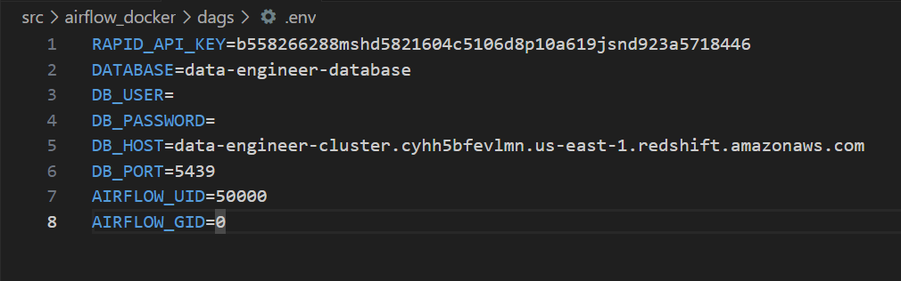
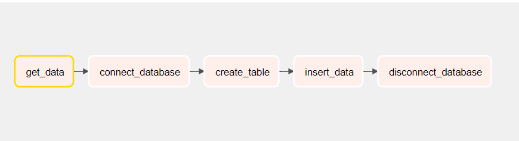

# Data Engineering NBA project

_This project is the result of what has been learned in DataEngineerin course 56025 from CoderHouse_

## Starting 🚀

_Following instructions will allow you to get a working copy on local for development and testing prouposes._


### Pre-requisites 📋

_What do you need to install and execute this script:_

```
Docker
Airflow
Python > 3.0
```

### variables 🔧


_create your local .env file with following data




### Tasks 📋

_What is this dag able to do?:_
```
get data from RAPID API regarding NBA games per day
Connect to Redshift Database 
create table in DB
clean and insert data into DB
Logout from DB
```


## Build with 🛠️

_Love_

* [Python](https://www.python.org/) - Scripts
* [Apache Airflow](https://airflow.apache.org) - Run, Schedule and monitor workdflows


## Thanks to 🎁

* CoderHouse 📢
* Last teacher in course, you are great 🤓.


---
⌨️ with ❤️ by *me*  😊
